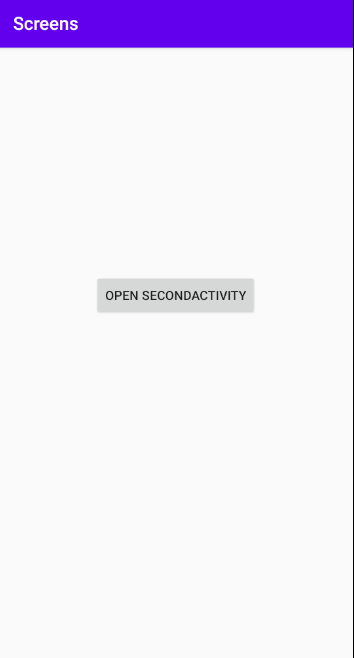
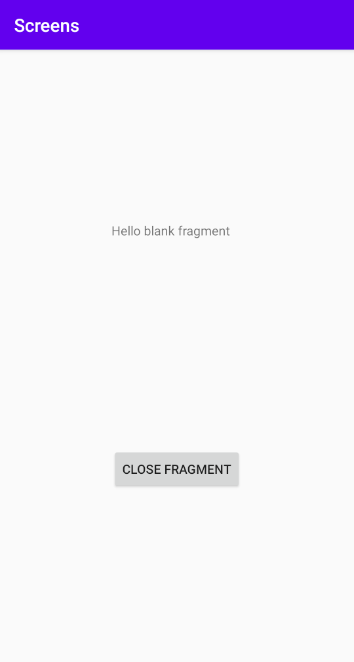

# Rapport

Jag började med att skapa en ny activity och namngav den som "SecondActivity".

Sedan skapade jag en LinearLayout innuti den nuvarande ConstraintLayout i filen `activity_main.xml`. Sedan tog jag bort TextView widgeten som fanns sedan tidigare och skapade en knapp istället. Hela koden syns nedan.

```xml
...
    <LinearLayout
        android:layout_width="wrap_content"
        android:layout_height="match_parent"
        app:layout_constraintBottom_toBottomOf="parent"
        app:layout_constraintLeft_toLeftOf="parent"
        app:layout_constraintRight_toRightOf="parent"
        app:layout_constraintTop_toTopOf="parent">

        <Button
            android:id="@+id/startSecondActivity"
            android:layout_width="match_parent"
            android:layout_height="wrap_content"
            android:text="Open SecondActivity"
            android:layout_marginTop="250dp"/>

    </LinearLayout>
...
```

Efter jag var nöjd med min layout skapade jag även knappen i `MainActivity` och gav den en onClickListener. Innuti onClick metoden skapar jag en intent som sedan öppnar `SecondActivity`. Jag skapar även ett logmeddelande för felsökning. Nedan är koden för min knapp I `MainActivity`.
```java
    Button knapp = findViewById(R.id.startSecondActivity);
    knapp.setOnClickListener(new View.OnClickListener() {
        @Override
        public void onClick(View view) {
            Intent intent = new Intent(MainActivity.this, SecondActivity.class);
            startActivity(intent);
            Log.d("Button_Click", "Start SecondActivity.");
        }
     });
```
Efter detta skapade jag ett fragment och la till en LinearLayout, det nyskapade fragmentet och en knapp i `activity_second.xml` för att stänga mitt fragment. Sedan la jag till knappen i `SecondActivity`. Jag skapade även en OnClickListener för min knapp för att kunna stänga den activity som är överst och visa den activity som är under. Bilderna nedan visar hur appen ser ut när den öppnas samt hur den ser ut när man har öppnat `SecondActivity`.




